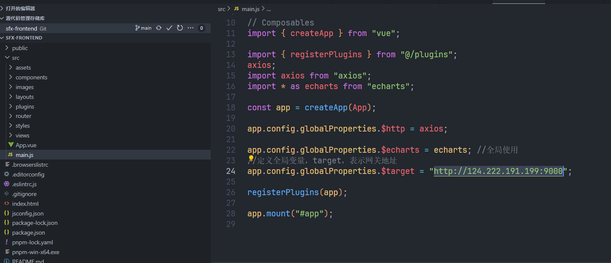
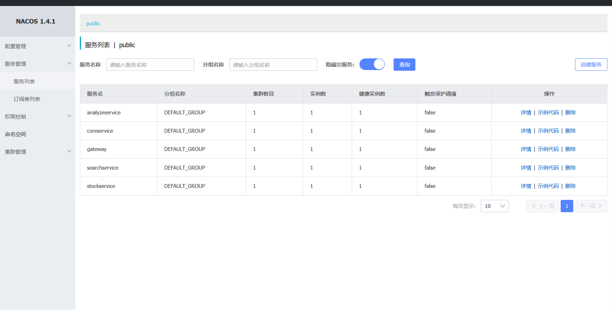

# Deployment Guide

访问[SmartFinanceX 部署指南(antio2.cn)](https://sfx.antio2.cn/script)以在线阅读本文

## Download

### 选项1：通过源码获取

| 仓库                                                                                    | 说明     |
| --------------------------------------------------------------------------------------- | -------- |
| [SmartFinanceX/sfx-backend(github.com)](https://github.com/SmartFinanceX/sfx-backend)   | 后端仓库 |
| [SmartFinanceX/sfx-frontend(github.com)](https://github.com/SmartFinanceX/sfx-frontend) | 前端仓库 |

通过下载源码，获取软件

### 选项2：下载编译文件

通过访问Release页面，下载已经编译完成的文件。

| 发布页                                                                                                                          | 说明       |
| ------------------------------------------------------------------------------------------------------------------------------- | ---------- |
| [Releases · SmartFinanceX/sfx-backend (github.com)](https://github.com/SmartFinanceX/sfx-backend/releases)                      | 后端发布页 |
| [Release Version 1.0 · SmartFinanceX/sfx-frontend (github.com)](https://github.com/SmartFinanceX/sfx-frontend/releases/tag/1.0) | 前端发布页 |

## Install

### 前置软件


| 软件    | 版本                 | 说明           |
| ------- | -------------------- | -------------- |
| Ubuntu  | 22.04LTS             | 操作系统[可选] |
| Windows | Windows11 22000.2057 | 操作系统[可选] |
| Java    | 18                   | Java运行环境   |
| Python  | 3.9                  | Python解释器   |
| node    | 16.17.1              | JS运行环境     |
| pnpm    | 8.3.1                | 包管理工具     |
| Nacos   | 1.4.1                | 微服务注册中心 |
| Maven   | 3.9.2                | 项目管理工具   |

### 部署数据库

在默认的生产环境配置中，使用的数据库端口为9980，默认用户名为root，默认密码为123456。

你可以选择使用docker来快速启动数据库。

```sh
docker pull mysql
docker run -itd --name sfx-db -p 9980:3306 -e MYSQL_ROOT_PASSWORD=123456 mysql
```

在创建好数据库之后，运行提供的SQL文件。进行初始化。因为不同的微服务使用不同的数据库，所以你需要创建不同的数据库来进行初始化。

| 路径                          | 所属数据库  | 说明           |
| ----------------------------- | ----------- | -------------- |
| sfx-analyze/sql/init&data.sql | sfx_analyze | 财务分析数据库 |
| sfx-auth/sql/sfx_user.sql     | sfx_user    | 权限信息数据库 |
| sfx-core/sql/sfx_db.sql       | sfx_db      | 公司信息数据库 |

### 部署ElasticSearch服务器

可以直接跳过这一步，使用我们已经提供好的检索服务器。

或者通过Docker进行部署。请参照[Install Elasticsearch with Docker | Elasticsearch Guide [8.8\] | Elastic](https://www.elastic.co/guide/en/elasticsearch/reference/current/docker.html)

在本项目中，请`docker pull elasticsearch:8.7.1`

### 部署Nacos

可以选择在Github上获取[Release 1.4.6 (Mar 25th, 2023) · alibaba/nacos (github.com)](https://github.com/alibaba/nacos/releases/tag/1.4.6) 或者直接使用本项目中`third-party/nacos/bin`下的启动脚本`startup.sh`或者`startup.cmd`进行Nacos启动。默认配置端口为`8848`。

## Compile

如果选择[下载编译好的文件](#选项2-下载编译文件)，你可以直接跳过这一步。

### 前端

首先需要`/src/main.js`中的`app.config.globalProperties.$target`修改为自己部署的后端网关地址,如图所示



在文件根目录下，运行指令`pnpm install`

在开发模式下，使用`pnpm dev`，即可以在本地运行前端服务器进行预览。或使用`pnpm build`进行构建操作，获得`dist` 文件夹。

*详情见项目中的README*

### 后端

使用Maven中的`package -f pom.xml`将项目打包，生成jar文件，如果你选择直接在开发环境运行，也可以跳过这一步。请保证您的Maven可以连接到中央仓库以获取依赖包。

对于启动预测分析服务器，你需要使用`pip install`为你的python安装以下库：

> pandas
>
> scikit-learn
>
> statistics
>
> statsmodels
>
> requests
>
> flask
>
> nacos-sdk-python

## Run

### 后端部署

#### Step 1

- 选项1：直接运行

通过直接运行项目源码下各文件夹中的`/src/main/**/*Service.java` ，作为Spring Boot的启动类启动服务。

- 选项2：通过Jar包运行

通过在之前提到过的[生成jar包](#后端)后，使用java -jar进行启动

```sh
nohup java -jar -Xmx512m  -Dspring.profiles.active=prod sfx-analyze-1.0.2.jar > logs/analyze.log 2>&1 &
nohup java -jar -Xmx512m  -Dspring.profiles.active=prod sfx-core-1.0.2.jar > logs/core.log 2>&1 &
nohup java -jar -Xmx512m  -Dspring.profiles.active=prod sfx-search-1.0.1.jar > logs/search.log 2>&1 &
nohup java -jar -Xmx512m  -Dspring.profiles.active=prod sfx-gateway-1.0.jar > logs/gateway.log 2>&1 &
```

一个运行的示例如上。你可以指定运行时所用的配置文件，以及生成日志文件的路径以检查是否运行成功。

如果你修改了数据库配置，使用JVM选项进行启动修改

```yaml
spring
	datasource
		url:
    	password:
    	user:
```

对于在多台服务器上部署的情况，你需要修改Nacos服务器的地址为公网地址，并修改自身服务器的发现地址为该服务器的公网IP。
（不过我不推荐这样做）

一个示例是：

比如Nacos部署在服务器A上，搜索服务器部署在服务器B上。

你需要在启动时(使用`-D`参数)进行如下修改：

```properties
spring.cloud.nacos.server-addr=A:port
spring.cloud.nacos.discovery.ip=B.ip
spring.cloud.nacos.discovery.port=B.port
```

否则其他微服务无法调用该服务，因为在本项目中，网关转发操作依赖负载均衡，所以用户也无法进行访问。

#### Step 2

使用Python启动股价，分析及预测服务器。

```bash
python3 sfx-stock/StockApplication.py
```

一个启动示例是：

```bash
nohup python3 flask/StockApplication.py > logs/stock.log 2>&1
```

#### Step 3

检查服务是否上线。

访问Nacos的端口,应该可以看到所有服务成功上线，如下图所示。




:::tip

你还可以通过更改`-Dserver.port=`选项，启动更多的服务实例

:::

### 前端部署

正如之前所说，你可以直接使用`pnpm dev`,在本地进行预览。不过为了部署在服务器上，你需要将[编译好的](#前端)`dist`文件夹部署在服务器上。

一个在`demo.sfx.antio2.cn`的Nginx部署示例配置是

```nginx
server
{
    listen 80;
    server_name demo.sfx.antio2.cn;
    index index.php index.html index.htm default.php default.htm default.html;
    root /www/wwwroot/demo.sfx.antio2.cn;

    #SSL-START SSL相关配置，请勿删除或修改下一行带注释的404规则
    #error_page 404/404.html;
    #SSL-END

    #ERROR-PAGE-START  错误页配置，可以注释、删除或修改
    #error_page 404 /404.html;
    #error_page 502 /502.html;
    #ERROR-PAGE-END

    #PHP-INFO-START  PHP引用配置，可以注释或修改
    include enable-php-00.conf;
    #PHP-INFO-END

    #REWRITE-START URL重写规则引用,修改后将导致面板设置的伪静态规则失效
    include /www/server/panel/vhost/rewrite/demo.sfx.antio2.cn.conf;
    #REWRITE-END

    #禁止访问的文件或目录
    location ~ ^/(\.user.ini|\.htaccess|\.git|\.env|\.svn|\.project|LICENSE|README.md)
    {
        return 404;
    }

    #一键申请SSL证书验证目录相关设置
    location ~ \.well-known{
        allow all;
    }

    #禁止在证书验证目录放入敏感文件
    if ( $uri ~ "^/\.well-known/.*\.(php|jsp|py|js|css|lua|ts|go|zip|tar\.gz|rar|7z|sql|bak)$" ) {
        return 403;
    }

    location ~ .*\.(gif|jpg|jpeg|png|bmp|swf)$
    {
        expires      30d;
        error_log /dev/null;
        access_log /dev/null;
    }

    location ~ .*\.(js|css)?$
    {
        expires      12h;
        error_log /dev/null;
        access_log /dev/null;
    }
    access_log  /www/wwwlogs/demo.sfx.antio2.cn.log;
    error_log  /www/wwwlogs/demo.sfx.antio2.cn.error.log;
}
```

## Additional

### 跨域

为了解决跨域问题，你可以选择：

- 安装跨域插件

[Access Control-Allow-Origin - Unblock :: WebExtension.ORG](https://webextension.org/listing/access-control.html)

- 将API平台和前端部署在同一源。

  - 首先，将[网关地址](#前端)后缀加上`/api`,例如`http://host/api`

  - 在网关服务器所属主机上，部署Nginx服务器，进行动静请求分离。

    ```nginx
    location /api {
        rewrite ^/api(.*)$ $1 break;
        proxy_pass http://localhost:9000;
    }
    ```

### 上云

请使用至少2核4g的服务器

在防火墙配置中，打开网关expose的端口。

若在多个服务器上配置，请在对应服务器上打开该微服务对应端口。
