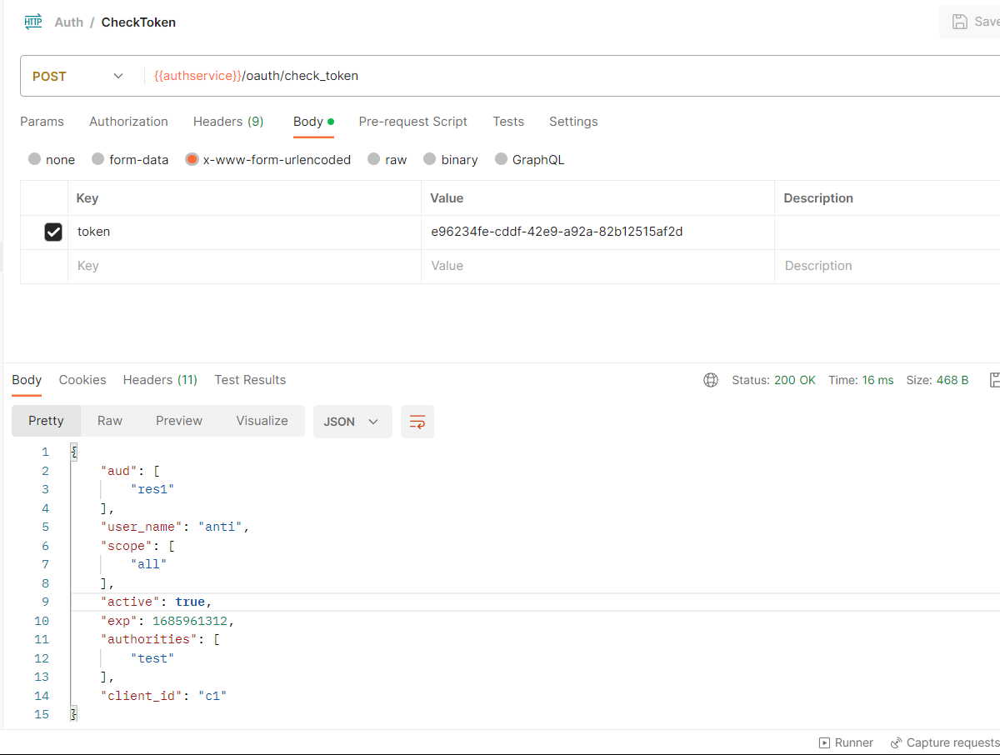

## 根据RBAC模型，创建权限相关表

### 创建权限表

```sql
CREATE TABLE `sys_menu` (
  `id` bigint NOT NULL AUTO_INCREMENT,
  `menu_name` varchar(64) NOT NULL DEFAULT 'NULL' COMMENT '菜单名',
  `path` varchar(200) DEFAULT NULL COMMENT '路由地址',
  `component` varchar(255) DEFAULT NULL COMMENT '组件路径',
  `visible` char(1) DEFAULT '0' COMMENT '菜单状态（0显示 1隐藏）',
  `status` char(1) DEFAULT '0' COMMENT '菜单状态（0正常 1停用）',
  `perms` varchar(100) DEFAULT NULL COMMENT '权限标识',
  `icon` varchar(100) DEFAULT '#' COMMENT '菜单图标',
  `create_by` bigint DEFAULT NULL,
  `create_time` datetime DEFAULT NULL,
  `update_by` bigint DEFAULT NULL,
  `update_time` datetime DEFAULT NULL,
  `del_flag` int DEFAULT '0' COMMENT '是否删除（0未删除 1已删除）',
  `remark` varchar(500) DEFAULT NULL COMMENT '备注',
  PRIMARY KEY (`id`)
) ENGINE=InnoDB AUTO_INCREMENT=4 DEFAULT CHARSET=utf8mb4 COLLATE=utf8mb4_0900_ai_ci COMMENT='菜单表';
```

### 创建角色表

```sql
CREATE TABLE `sys_role` (
  `id` bigint NOT NULL AUTO_INCREMENT,
  `name` varchar(128) DEFAULT NULL,
  `role_key` varchar(100) DEFAULT NULL COMMENT '角色权限字符串',
  `status` char(1) DEFAULT '0' COMMENT '角色状态（0正常 1停用）',
  `del_flag` int DEFAULT '0' COMMENT 'del_flag',
  `create_by` bigint DEFAULT NULL,
  `create_time` datetime DEFAULT NULL,
  `update_by` bigint DEFAULT NULL,
  `update_time` datetime DEFAULT NULL,
  `remark` varchar(500) DEFAULT NULL COMMENT '备注',
  PRIMARY KEY (`id`)
) ENGINE=InnoDB AUTO_INCREMENT=5 DEFAULT CHARSET=utf8mb4 COLLATE=utf8mb4_0900_ai_ci COMMENT='角色表';

```

### 创建用户表

```sql
CREATE TABLE `sys_user` (
  `id` bigint NOT NULL AUTO_INCREMENT COMMENT '主键',
  `user_name` varchar(64) NOT NULL DEFAULT 'NULL' COMMENT '用户名',
  `nick_name` varchar(64) NOT NULL DEFAULT 'NULL' COMMENT '昵称',
  `password` varchar(64) NOT NULL DEFAULT 'NULL' COMMENT '密码',
  `status` char(1) DEFAULT '0' COMMENT '账号状态（0正常 1停用）',
  `email` varchar(64) DEFAULT NULL COMMENT '邮箱',
  `phonenumber` varchar(32) DEFAULT NULL COMMENT '手机号',
  `sex` char(1) DEFAULT NULL COMMENT '用户性别（0男，1女，2未知）',
  `avatar` varchar(128) DEFAULT NULL COMMENT '头像',
  `user_type` char(1) NOT NULL DEFAULT '1' COMMENT '用户类型（0管理员，1普通用户）',
  `create_by` bigint DEFAULT NULL COMMENT '创建人的用户id',
  `create_time` datetime DEFAULT NULL COMMENT '创建时间',
  `update_by` bigint DEFAULT NULL COMMENT '更新人',
  `update_time` datetime DEFAULT NULL COMMENT '更新时间',
  `del_flag` int DEFAULT '0' COMMENT '删除标志（0代表未删除，1代表已删除）',
  PRIMARY KEY (`id`)
) ENGINE=InnoDB AUTO_INCREMENT=1637028625444241410 DEFAULT CHARSET=utf8mb4 COLLATE=utf8mb4_0900_ai_ci COMMENT='用户表';

```

### 创建 用户->角色表

```sql
CREATE TABLE `sys_user_role` (
  `user_id` bigint NOT NULL AUTO_INCREMENT COMMENT '用户id',
  `role_id` bigint NOT NULL DEFAULT '0' COMMENT '角色id',
  PRIMARY KEY (`user_id`,`role_id`)
) ENGINE=InnoDB AUTO_INCREMENT=5 DEFAULT CHARSET=utf8mb4 COLLATE=utf8mb4_0900_ai_ci;

```

### 创建角色->权限表

```sql
CREATE TABLE `sys_role_menu` (
  `role_id` bigint NOT NULL AUTO_INCREMENT COMMENT '角色ID',
  `menu_id` bigint NOT NULL DEFAULT '0' COMMENT '菜单id',
  PRIMARY KEY (`role_id`,`menu_id`)
) ENGINE=InnoDB AUTO_INCREMENT=5 DEFAULT CHARSET=utf8mb4 COLLATE=utf8mb4_0900_ai_ci;

```

### 创建客户端信息

```sql
DROP TABLE IF EXISTS `oauth_client_details`;
CREATE TABLE `oauth_client_details` (
`client_id` varchar(255) CHARACTER SET utf8 COLLATE utf8_general_ci NOT NULL COMMENT '客户端标
识',
`resource_ids` varchar(255) CHARACTER SET utf8 COLLATE utf8_general_ci NULL DEFAULT NULL
COMMENT '接入资源列表',
`client_secret` varchar(255) CHARACTER SET utf8 COLLATE utf8_general_ci NULL DEFAULT NULL
COMMENT '客户端秘钥',
`scope` varchar(255) CHARACTER SET utf8 COLLATE utf8_general_ci NULL DEFAULT NULL,
`authorized_grant_types` varchar(255) CHARACTER SET utf8 COLLATE utf8_general_ci NULL DEFAULT
NULL,
`web_server_redirect_uri` varchar(255) CHARACTER SET utf8 COLLATE utf8_general_ci NULL DEFAULT
NULL,
`authorities` varchar(255) CHARACTER SET utf8 COLLATE utf8_general_ci NULL DEFAULT NULL,
`access_token_validity` int(11) NULL DEFAULT NULL,
`refresh_token_validity` int(11) NULL DEFAULT NULL,
`additional_information` longtext CHARACTER SET utf8 COLLATE utf8_general_ci NULL,
`create_time` timestamp(0) NOT NULL DEFAULT CURRENT_TIMESTAMP(0) ON UPDATE
CURRENT_TIMESTAMP(0),
`archived` tinyint(4) NULL DEFAULT NULL,
`trusted` tinyint(4) NULL DEFAULT NULL,
`autoapprove` varchar(255) CHARACTER SET utf8 COLLATE utf8_general_ci NULL DEFAULT NULL,
PRIMARY KEY (`client_id`) USING BTREE
) ENGINE = InnoDB CHARACTER SET = utf8 COLLATE = utf8_general_ci COMMENT = '接入客户端信息'
ROW_FORMAT = Dynamic;
```

### 创建授权码

```sql
DROP TABLE IF EXISTS `oauth_code`;
CREATE TABLE `oauth_code` (
`create_time` timestamp(0) NOT NULL DEFAULT CURRENT_TIMESTAMP,
`code` varchar(255) CHARACTER SET utf8 COLLATE utf8_general_ci NULL DEFAULT NULL,
`authentication` blob NULL,
INDEX `code_index`(`code`) USING BTREE
) ENGINE = InnoDB CHARACTER SET = utf8 COLLATE = utf8_general_ci ROW_FORMAT = Compact;
```

:::warning TODO

优化改为使用Redis存储授权码

:::

### 通过脚本创建

::: warning 
将会删除数据库重建！
:::

```sql
CREATE TABLE `sys_menu` (
  `id` bigint NOT NULL AUTO_INCREMENT,
  `menu_name` varchar(64) NOT NULL DEFAULT 'NULL' COMMENT '菜单名',
  `path` varchar(200) DEFAULT NULL COMMENT '路由地址',
  `component` varchar(255) DEFAULT NULL COMMENT '组件路径',
  `visible` char(1) DEFAULT '0' COMMENT '菜单状态（0显示 1隐藏）',
  `status` char(1) DEFAULT '0' COMMENT '菜单状态（0正常 1停用）',
  `perms` varchar(100) DEFAULT NULL COMMENT '权限标识',
  `icon` varchar(100) DEFAULT '#' COMMENT '菜单图标',
  `create_by` bigint DEFAULT NULL,
  `create_time` datetime DEFAULT NULL,
  `update_by` bigint DEFAULT NULL,
  `update_time` datetime DEFAULT NULL,
  `del_flag` int DEFAULT '0' COMMENT '是否删除（0未删除 1已删除）',
  `remark` varchar(500) DEFAULT NULL COMMENT '备注',
  PRIMARY KEY (`id`)
) ENGINE=InnoDB AUTO_INCREMENT=4 DEFAULT CHARSET=utf8mb4 COLLATE=utf8mb4_0900_ai_ci COMMENT='菜单表';
CREATE TABLE `sys_role` (
  `id` bigint NOT NULL AUTO_INCREMENT,
  `name` varchar(128) DEFAULT NULL,
  `role_key` varchar(100) DEFAULT NULL COMMENT '角色权限字符串',
  `status` char(1) DEFAULT '0' COMMENT '角色状态（0正常 1停用）',
  `del_flag` int DEFAULT '0' COMMENT 'del_flag',
  `create_by` bigint DEFAULT NULL,
  `create_time` datetime DEFAULT NULL,
  `update_by` bigint DEFAULT NULL,
  `update_time` datetime DEFAULT NULL,
  `remark` varchar(500) DEFAULT NULL COMMENT '备注',
  PRIMARY KEY (`id`)
) ENGINE=InnoDB AUTO_INCREMENT=5 DEFAULT CHARSET=utf8mb4 COLLATE=utf8mb4_0900_ai_ci COMMENT='角色表';
CREATE TABLE `sys_user` (
  `id` bigint NOT NULL AUTO_INCREMENT COMMENT '主键',
  `user_name` varchar(64) NOT NULL DEFAULT 'NULL' COMMENT '用户名',
  `nick_name` varchar(64) NOT NULL DEFAULT 'NULL' COMMENT '昵称',
  `password` varchar(64) NOT NULL DEFAULT 'NULL' COMMENT '密码',
  `status` char(1) DEFAULT '0' COMMENT '账号状态（0正常 1停用）',
  `email` varchar(64) DEFAULT NULL COMMENT '邮箱',
  `phonenumber` varchar(32) DEFAULT NULL COMMENT '手机号',
  `sex` char(1) DEFAULT NULL COMMENT '用户性别（0男，1女，2未知）',
  `avatar` varchar(128) DEFAULT NULL COMMENT '头像',
  `user_type` char(1) NOT NULL DEFAULT '1' COMMENT '用户类型（0管理员，1普通用户）',
  `create_by` bigint DEFAULT NULL COMMENT '创建人的用户id',
  `create_time` datetime DEFAULT NULL COMMENT '创建时间',
  `update_by` bigint DEFAULT NULL COMMENT '更新人',
  `update_time` datetime DEFAULT NULL COMMENT '更新时间',
  `del_flag` int DEFAULT '0' COMMENT '删除标志（0代表未删除，1代表已删除）',
  PRIMARY KEY (`id`)
) ENGINE=InnoDB AUTO_INCREMENT=1637028625444241410 DEFAULT CHARSET=utf8mb4 COLLATE=utf8mb4_0900_ai_ci COMMENT='用户表';
CREATE TABLE `sys_user_role` (
  `user_id` bigint NOT NULL AUTO_INCREMENT COMMENT '用户id',
  `role_id` bigint NOT NULL DEFAULT '0' COMMENT '角色id',
  PRIMARY KEY (`user_id`,`role_id`)
) ENGINE=InnoDB AUTO_INCREMENT=5 DEFAULT CHARSET=utf8mb4 COLLATE=utf8mb4_0900_ai_ci;
CREATE TABLE `sys_role_menu` (
  `role_id` bigint NOT NULL AUTO_INCREMENT COMMENT '角色ID',
  `menu_id` bigint NOT NULL DEFAULT '0' COMMENT '菜单id',
  PRIMARY KEY (`role_id`,`menu_id`)
) ENGINE=InnoDB AUTO_INCREMENT=5 DEFAULT CHARSET=utf8mb4 COLLATE=utf8mb4_0900_ai_ci;
DROP TABLE IF EXISTS `oauth_client_details`;
CREATE TABLE `oauth_client_details` (
`client_id` varchar(255) CHARACTER SET utf8 COLLATE utf8_general_ci NOT NULL COMMENT '客户端标
识',
`resource_ids` varchar(255) CHARACTER SET utf8 COLLATE utf8_general_ci NULL DEFAULT NULL
COMMENT '接入资源列表',
`client_secret` varchar(255) CHARACTER SET utf8 COLLATE utf8_general_ci NULL DEFAULT NULL
COMMENT '客户端秘钥',
`scope` varchar(255) CHARACTER SET utf8 COLLATE utf8_general_ci NULL DEFAULT NULL,
`authorized_grant_types` varchar(255) CHARACTER SET utf8 COLLATE utf8_general_ci NULL DEFAULT
NULL,
`web_server_redirect_uri` varchar(255) CHARACTER SET utf8 COLLATE utf8_general_ci NULL DEFAULT
NULL,
`authorities` varchar(255) CHARACTER SET utf8 COLLATE utf8_general_ci NULL DEFAULT NULL,
`access_token_validity` int(11) NULL DEFAULT NULL,
`refresh_token_validity` int(11) NULL DEFAULT NULL,
`additional_information` longtext CHARACTER SET utf8 COLLATE utf8_general_ci NULL,
`create_time` timestamp(0) NOT NULL DEFAULT CURRENT_TIMESTAMP(0) ON UPDATE
CURRENT_TIMESTAMP(0),
`archived` tinyint(4) NULL DEFAULT NULL,
`trusted` tinyint(4) NULL DEFAULT NULL,
`autoapprove` varchar(255) CHARACTER SET utf8 COLLATE utf8_general_ci NULL DEFAULT NULL,
PRIMARY KEY (`client_id`) USING BTREE
) ENGINE = InnoDB CHARACTER SET = utf8 COLLATE = utf8_general_ci COMMENT = '接入客户端信息'
ROW_FORMAT = Dynamic;


DROP TABLE IF EXISTS `oauth_code`;
CREATE TABLE `oauth_code` (
`create_time` timestamp(0) NOT NULL DEFAULT CURRENT_TIMESTAMP,
`code` varchar(255) CHARACTER SET utf8 COLLATE utf8_general_ci NULL DEFAULT NULL,
`authentication` blob NULL,
INDEX `code_index`(`code`) USING BTREE
) ENGINE = InnoDB CHARACTER SET = utf8 COLLATE = utf8_general_ci ROW_FORMAT = Compact;
```

## 插入测试数据

:::tip

待补充脚本

:::

## 认证授权流程

### 获取token

#### 账号密码

- 通过访问`{{authservice}}/oauth/token`，并在body中填写相关信息获取token。

以测试用户为例

```http
POST /oauth/token HTTP/1.1
Host: 127.0.0.1:9020
Content-Type: application/x-www-form-urlencoded
Content-Length: 124

client_id=c1&client_secret=secret&grant_type=password&username=anti&password=123456&redirect_uri=https%3A%2F%2Fwww.baidu.com
```


### 校验token

通过 `POST {{authservice}}/oauth/check_token`校验token



### 发起请求

按照oauth2.0协议要求，请求资源需要携带token，如下：
token的参数名称为：Authorization，值为：Bearer token值

