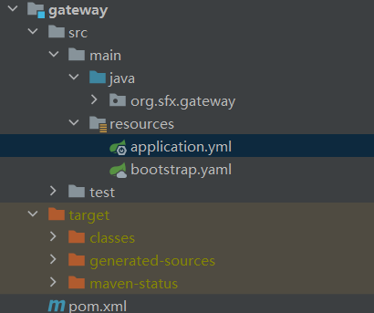

## 本周任务：
2023年5月15日

DDL 2023年5月20日

- 前端：
  - 实现通过chart.js 生成不同类别财务信息的图表。
  - 优化配色 
  - 公司信息和图表布局

- 后端：
  - 优化网关
  - 实现更多检索接口
  - 实现数据获取接口

- 数据分析：
  - 优化预测模型
  - 能够套用公式显示更多数据

- 数据获取：
  - 优化代码格式，增加可用性
  - 优化爬虫性能

- **@所有人：**
  - 为了之后联合协调，学会使用Github，熟练使用以下功能：
    - 分支管理
    - 创建Pull Request
    - 学会管理分支冲突

:::tip 小任务

所有人都必须完成，不懂可以问我

- 将本仓库clone到本地

`git clone git@github.com:SmartFinanceX/sfx-docs.git`
（如果已获取，使用`git pull` 如果出现分支冲突，学会处理合并）

- 创建新分支并切换到新分支
`git switch -c <分支名>`
- 写下自己的进度汇报
- 学习[git commit 规范指南 ](https://www.jianshu.com/p/201bd81e7dc9?utm_source=oschina-app)
- 提交到远程仓库
- 创建Pull Request,合并到`main`分支

**完成远程仓库合并后，该页面贡献者应当出现你的ID**

By [AntiO2 (AntiO₂) (github.com)](https://github.com/AntiO2)

:::

## 进度汇报
写自己完成的具体代码，以及Github仓库的Commit号
### 前端

### 后端

- 使用Spring Gateway 完成了开发环境网关配置。Commit: [feat gateway · SmartFinanceX/sfx-backend@d2455cf (github.com)](https://github.com/SmartFinanceX/sfx-backend/commit/d2455cfa1fbd7536d59c4956b5552d5a8369f28f)
  

- 信息检索
  - 完善了接口文档[信息接口 | SmartFinanceX (antio2.cn)](https://sfx.antio2.cn/API/1.html#聚合检索)
  - 补全了分页查询接口以及FeignClient[feat(search) 追加了分页查询功能&FeignClient · SmartFinanceX/sfx-backend@e61168b (github.com)](https://github.com/SmartFinanceX/sfx-backend/commit/e61168b410bb9b2d0b93948403c24f510d62346d)
- 财务信息检索
  - [feat(search) data · SmartFinanceX/sfx-backend@054694a (github.com)](https://github.com/SmartFinanceX/sfx-backend/commit/054694a0adae02f7c6242ec6a7a7b21f5cf3dacd)
  - 更新了对应接口文档。

### 数据分析

### 数据获取
继续学习git操作
优化了地址格式（文档地址在代码开头全部给出），优化了代码结构，删除了一些冗余代码和注释
（https://github.com/SmartFinanceX/sfx-crapper/commit/0e46989d62aa8a8541ad6b47f195c6060ac5eee5）
## 下周计划

>  自己还有哪些工作没完成?
>
> 下周计划？

### 后端

- 修复一些bug
- 自动化调用python脚本进行分析。

### 数据获取
- 爬取部分公司股价信息
