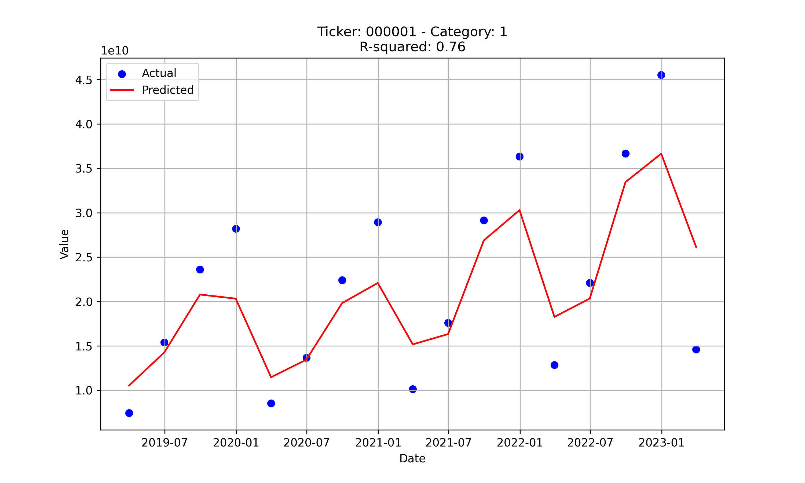

- 数据获取
   - 编写爬虫程序补充公司基本信息条目，具体包括：公司所在省份、所在城市、员工数量、产品类型等信息
   - (https://github.com/SmartFinanceX/sfx-crapper/commit/f7534916d20e50a1a0badf84debee099b22b7cc0)
- 数据分析
   - 尝试了向量回归（SVR）模型，随机森林算法（Random Forest Regression）等模型，发现随机森林算法的R系数较优（下面是该算法模拟的一个例子）
   - 

下周计划
- 数据获取
	- 继续补充公司基本信息
- 数据分析
   - 尝试对不同的模型进行不同的算法，最后选择令每组数据能最优模拟的算法，并展示相关图片
   - 继续学习git，pandas，Python相关算法
