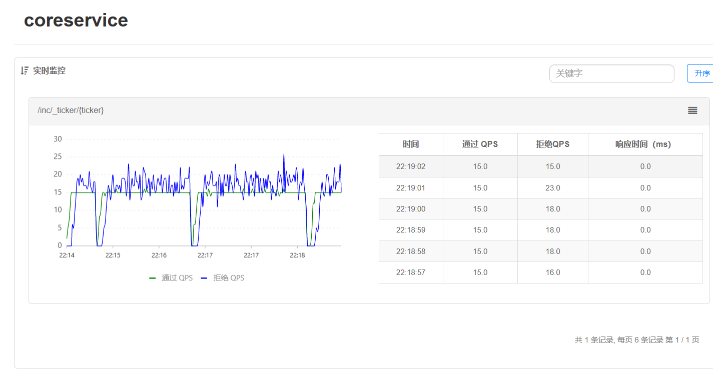

## 数据获取
   - 编写爬虫程序补充公司基本信息条目，具体包括：公司所在省份、所在城市、员工数量、产品类型等信息
   - (https://github.com/SmartFinanceX/sfx-crapper/commit/f7534916d20e50a1a0badf84debee099b22b7cc0)
## 数据分析
   - 尝试了向量回归（SVR）模型，随机森林算法（Random Forest Regression）等模型，发现随机森林算法的R系数较优（下面是该算法模拟的一个例子）
   - 
- 前端-吴少辉：
   - 本周注重学习了git的使用方法，包括[git-book](https://git-scm.com/book/en/v2)和一个个人认为讲的比较好的[B站视频](https://www.bilibili.com/video/BV1pX4y1S7Dq/?spm_id_from=333.999.0.0&vd_source=ea56ce2bcf0af66f314617562fc74539)；
   - 阅读了GitHub的文档，学习了GitHub的使用，尤其是 Pull Request ；
   - 学习了Vue框架的搭建，顺带了解了什么是ts和vite；
   - 对前端页面的布局进行了一定的优化，但是还未完成。

## 后端

- 解决了从数据库中获取数组的问题[Issue #2 · SmartFinanceX/sfx-backend (github.com)](https://github.com/SmartFinanceX/sfx-backend/issues/2)

- 添加了流量控制功能，进行了初步的性能测试[b8ca9af ](https://github.com/SmartFinanceX/sfx-backend/commit/b8ca9af7a5138442b1a66f86ffe4a135f054b93e)

  

## 下周计划

- 数据获取
	- 继续补充公司基本信息
- 数据分析
   - 尝试对不同的模型进行不同的算法，最后选择令每组数据能最优模拟的算法，并展示相关图片
   - 继续学习git，pandas，Python相关算法
- 前端
   - 继续学习，补充完成项目所需要的知识和技能；
   - 继续完成页面的布局；
   - 尝试用Vue框架来封装和编写页面。
